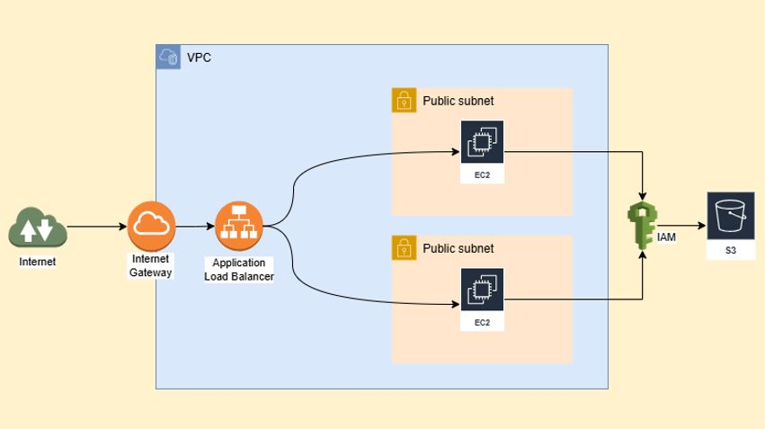

# Terraform AWS Infrastructure Deployment

This repository contains the Terraform configuration files to create and deploy an AWS infrastructure. The setup includes a VPC, public subnets, EC2 instances, an Application Load Balancer (ALB), an S3 bucket, IAM roles/policies, and user data to configure Apache2 with a custom webpage. The project uses **S3 as a remote backend** for storing the Terraform state and **DynamoDB for state locking**, ensuring consistency during deployments.

## Workflow Overview



## Features

1. **VPC and Subnets**:
   - A custom VPC with an Internet Gateway (IGW) for internet access.
   - Two public subnets to host EC2 instances.

2. **EC2 Instances**:
   - Two EC2 instances, one in each public subnet.
   - User data script to automatically install and configure Apache2 and deploy a custom webpage.

3. **Application Load Balancer (ALB)**:
   - ALB forwards external traffic to the EC2 instances.

4. **S3 Bucket**:
   - A bucket to store application files and other data.
   - Configured IAM role and policy to allow EC2 instances to access the S3 bucket.

5. **Terraform Backend**:
   - S3 bucket for storing the remote Terraform state.
   - DynamoDB table for state locking to ensure consistency during deployment.

6. **Security**:
   - Sensitive variables managed in a `terraform.tfvars` file.
   - IAM roles and policies configured with the principle of least privilege.

## Prerequisites

- Terraform installed 
- AWS CLI installed and configured 
- An AWS account with the necessary permissions

## Steps to Deploy

1. **Clone the Repository**:
   ```bash
   git clone https://github.com/shamim-iq/Terraform_aws_Infra_deployment.git
   cd Terraform_aws_Infra_deployment

2. **Initialize Terraform**:  
   Initialize the Terraform backend using the S3 bucket and DynamoDB table.

   ```bash
   terraform init
   
3. **Review and Apply Configuration**:  
   
   - Check the execution plan-
   ```bash
   terraform plan
   ```
   
   - Apply the configuration-
   ```bash
   terraform apply
   ```
3. **Access the Infrastructure**:  
   
   - Retrieve the public DNS of the ALB from the Terraform output-
   ```bash
   terraform output
   ```
   - Access your application via the ALB URL in a browser.
     
4. **Clean Up Resources**:
   - To destroy the infrastructure and avoid incurring additional costs-
   ```bash
   terraform destroy
   ```
